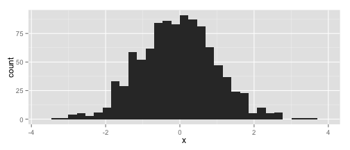
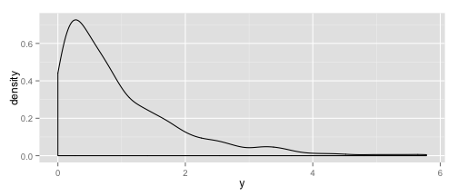

## Air Quality

1. Using the dataset `airquality`, create a data.frame giving the 
average, minimum and maximum monthly temperature and ozone level
2. Using the same dataset, create plots of daily temperature and ozone levels for each month
3. Create a panel of plots (in a single window) showing the daily temperature pattern by month
4. Create plot(s) showing how ozone relates to wind, temperature and solar radiation

For details about the dataset, try `?airquality`.

For hints, press `p`

*** pnotes


```r
data(airquality)
library(plyr)
library(ggplot2)
ddply(airquality, ~Month, summarise, ...)
aq5 <- subset(airquality, Month == 5)
plot(Ozone ~ Day, data = aq5)

ggplot(airquality, aes(x = Day, y = Ozone)) + geom_point() + facet_wrap(~Month)

pairs(airquality[, c("Ozone", "Wind", "Temp")])

```


---

## Air Quality

The R function `lm` stands for **linear model** and does linear regression.

Recall that we can write regressions like formulas:
```
lm(y ~ x1 + x2 + x3, data=dat)
```

1. Fit a linear regression model to see how ozone level relates to temperature, wind speed and solar radiation levels, making sure you store the result in an object (say `model1`).
2. Use `summary(model1)` to see the results. Store this in an object
3. Use the object created above to compute 95% confidence intervals for each coefficient
  - Use the function `names` to see components of the object
  - Use matrix extraction rules to extract appropriate columns


Hints on pressing `p`

*** pnotes


```r
model1 <- lm(Ozone ~ Temp + Wind, data = airquality)
summ1 <- summary(model1)
names(summ1)
summ1$coef
is.data.frame(summ1$coef)

```


---

## Air quality

You can write functions in R to encapsulate repeatable tasks. The general format for functions is
``` 
functionName <- function(arg1, arg2,){
  # Code to be evaluated
}
```

+ Write a function that takes as input the result of a linear regression and the confidence level and outputs a data.frame with each row consisting of a coefficient estimate and the confidence interval
  - If the confidence level is `1-alpha`, you can get the appropriate standard normal quantile using `qnorm(1-alpha)`

Hints on pressing `p`.

*** pnotes


```r

conf.int <- function(mod, conf.level = 0.95) {
    summ <- summary(mod)
    q.alpha <- qnorm(conf.level)
    output <- data.frame(Estimate = summ[, 1], LCB = summ[, 1] - q.alpha * summ[, 
        2])
    return(output)
}
```

--- .segue .dark

## Generalized linear models

---

## A quick review

Generalized linear models are extensions of linear models, that are based on the exponential
family of distributions. They are characterized by three components:

+ A distribution (normal/Gaussian, exponential, binomial, Poisson, Weibull, and so on)
+ A linear predictor $\eta = X\beta$
+ A _link function_ relating the expected outcome to the predictor: $E(Y) = \mu = g^{-1}(\eta)$. There are standard or "natural" links for different distributions, giving rise to familiar models

This framework includes several classical models:

1. Ordinary least squares / linear regression
2. Logistic regression (Note, probit and tobit regressions involve changing the link, but in the same framework)
3. Poisson regression / log-linear models
4. Weibull regression

---

## GLMs in R

R provides a function `glm` which performs generalized linear regression.

```
## function (formula, family = gaussian, data, weights, subset, 
##     na.action, start = NULL, etastart, mustart, offset, control = list(...), 
##     model = TRUE, method = "glm.fit", x = FALSE, y = TRUE, contrasts = NULL, 
##     ...) 
## NULL
```


The arguments you will need often are `formula`, `family`, `data`, `subset` and `na.action`. The rest give finer control over the fitting algorithm.

Details of the different arguments, as well as different components of the model object that is created, can be found by `help(glm)`.

---

## GLMs in R

The `family` argument takes either a family function or the name of the family function (which uses the default link). The following families and default links are included. Note that these families reflect the distribution of the **dependent variable**

Distribution     | Family function  
-----------------|-----------------------
Binomial         | `binomial(link='logit')` 
Normal           | `gaussian(link='logit')` 
Gamma            | `Gamma(link='inverse')`
Inverse Gaussian | `inverse.gaussian(link="1/mu^2")`
Poisson          | `poisson(link='log')`

For other available links, see `help(family)`

---

## Example: Logistic regression

A logistic regression can be run using the following code:

```r
model1 <- glm(case ~ spontaneous + induced, data = infert, family = binomial)
summary(model1)$coef
```

```
##             Estimate Std. Error z value  Pr(>|z|)
## (Intercept)  -1.7079     0.2677  -6.380 1.776e-10
## spontaneous   1.1972     0.2116   5.657 1.543e-08
## induced       0.4181     0.2056   2.033 4.201e-02
```


Here `case` is a numeric object taking values 0 and 1. You can also use a factor
object with only two levels, such as "yes" and "no". R will convert this to a 0-1 variable 
for fitting.

---

## Example: Logistic regression

You can also do logistic regression if you have numbers of "yes"'s and "no"'s, 
or number of cases and controls. In this situation, the response is a 2-column matrix 
of the number of cases and number of controls


```r
data(esoph)
model2 <- glm(cbind(ncases, ncontrols) ~ agegp + tobgp * alcgp, data = esoph, 
    family = binomial)
```


Note, in the code, `tobgp*alcgp` is shorthand for the main effects _and_ the 2-way interaction between
the variables. You could also write it separately as `tobgp + alcgp + tobgp:alcgp`

---

## Diagnostic plots

Linear models and GLMs share the same set of diagnostic plots. I demonstrate using a linear model.

```r
data(mtcars)
model3 <- lm(mpg ~ wt + as.factor(cyl), data = mtcars)
par(ask = T)  # This will ask you before changing the plot in the window
plot(model3)
```


---

## Preview

I will go into some detail about how to fit GLMs, run several examples with you, and show how to easily extract the results to paste into your Word document or Powerpoint presentation


> Two packages I will heavily use for reporting are `knitr` and `pander`. Please make
sure they are installed on your computer. These will make life much easier. Also, please
install Pandoc from [here](http://johnmacfarlane.net/pandoc)


--- .segue .dark

## Predictive modeling

---

## Main concepts

+ Splitting the data into training and test sets
+ Evaluating model performance
+ Using rich R resources to run different predictive models

> The main packages I will use here are `caret`, `AppliedPredictiveModeling`, `randomForest`, 
`ipred`, `elasticnet`, `gbm`. Please have them installed on your machine.

---

## Splitting data

The basic idea is to train the model on one data set and then test its performance on another. If you
test it on the same data set you trained on, the performance will be over-optimistic and you will 
almost certainly be overfitting. We will talk about single training-test split, as well as _k_-fold crossvalidation. This step is the crux of getting good predictive models tuned. 

Our workhorses will be `AppliedPredictiveModeling::createDataPartition` and `caret::createFolds` (the nomenclature here is `package::function`)

---

## Evaluating models

For continuous outcomes, we will often use RMSE (root mean square error). 

For categorical outcomes, the confusion matrix is often used. I will also talk about ROC curves,
calibration, equivocal predictions and Brier scores as a preferred metric for performance evaluation.

---

## Modeling

We will survey a few types of models:
+ Logistic regression
+ Decision trees
+ Random Forest
+ Boosted trees
+ Ridge regression and other penalized regression
+ Bagging predictors

A cursory (Wikipedia) look at these methods would be good before Friday

--- .segue .dark

## Simulation

---

## Random number generation

+ R has random number generators for several distributions, including normal, binomial, beta, chi-squared,
Gamma, exponential, F, geometric, multinomial and others. For a full list see `help(Distributions)`
+ R has also several RNG kinds available. The default is "Mersenne-Twister". See `help(RNG)` for other options.
+ The typical random number generation function has the template `r{distribution}`, so
  - `rnorm` (Normal)
  - `rbinom` (Binomial)
  - `rexp` (Exponential)
  - `rpois` (Poisson)
  - `rf` (F)
  - `rgamma` (Gamma)

---

## Random number generation


```r
library(ggplot2)
x <- rnorm(1000)
qplot(x)
```

 


---

## Random number generation


```r
library(ggplot2)
y <- rexp(1000)
qplot(y, geom = "density")
```

 


---

## DES / Microsimulation

R does not have dedicated packages for DES, but all the components you need can
be done in R. This makes sense, since all simulation schema are different, and it is a 
matter of mixing and matching the components. Following Nance (1993) and (1995), a 
DES programming language must have the following:

+ generation of random numbers to represent uncertainty
+ process transformers, to allow non-uniform randomness to be generated
+ list processing, so objects can be created, manipulated and deleted
+ statistical analysis routines
+ report generation
+ a time flow mechanism

R satisfies these. I will work through a simple example of a M/M/1 queue to show
how a DES can be programmed in R.

---

## DES / Microsimulation

There is one, rather simplistic, general microsimulation package in R, [simario](http://code.google.com/p/simario). There is also a package, `sms` for spatial microsimulation, available on CRAN. 

A nice presentation on microsimulation in R is available [here](docs/clements-srug-2012.pdf)


