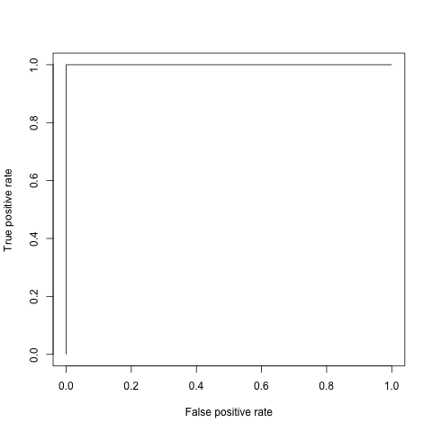

% Anonymous
% Anonymous's report
% Fri Aug 23 11:19:16 2013

           &nbsp;             Estimate   Std. Error   z value   Pr(>|z|) 
---------------------------- ---------- ------------ --------- ----------
      **(Intercept)**          -6.391      1.063      -6.012   1.832e-09 
       **agegp35-44**          1.586       1.068       1.485     0.1375  
       **agegp45-54**          2.983       1.024       2.914    0.003573 
       **agegp55-64**           3.35        1.02       3.286    0.001017 
       **agegp65-74**          3.729       1.025       3.637   0.0002754 
        **agegp75+**           3.655       1.067       3.426   0.0006123 
       **tobgp10-19**          1.147       0.4835      2.373    0.01763  
       **tobgp20-29**           1.21       0.5941      2.037    0.04163  
        **tobgp30+**           1.785       0.6142      2.907    0.003653 
       **alcgp120+**           2.818       0.4814      5.853   4.838e-09 
       **alcgp40-79**          1.678       0.3941      4.258   2.061e-05 
      **alcgp80-119**          2.033       0.4376      4.647   3.362e-06 
  **tobgp10-19:alcgp120+**     -1.046      0.7073     -1.479     0.1391  
  **tobgp20-29:alcgp120+**    -0.8923      0.856      -1.042     0.2972  
   **tobgp30+:alcgp120+**      -1.567      0.8279     -1.893    0.05834  
 **tobgp10-19:alcgp40-79**    -0.9879      0.5894     -1.676     0.0937  
 **tobgp20-29:alcgp40-79**     -0.979      0.6919     -1.415     0.1571  
  **tobgp30+:alcgp40-79**     -0.8804      0.7614     -1.156     0.2475  
 **tobgp10-19:alcgp80-119**   -0.9717      0.6188      -1.57     0.1164  
 **tobgp20-29:alcgp80-119**    -1.082      0.8138      -1.33     0.1836  
  **tobgp30+:alcgp80-119**    -0.9878      0.8355     -1.182     0.2371  

Table: Fitting generalized (binomial/logit) linear model: cbind(ncases, ncontrols) ~ agegp + tobgp * alcgp

           &nbsp;             Estimate   Std. Error   z value   Pr(>|z|) 
---------------------------- ---------- ------------ --------- ----------
      **(Intercept)**          -6.391      1.063      -6.012   1.832e-09 
       **agegp35-44**          1.586       1.068       1.485     0.1375  
       **agegp45-54**          2.983       1.024       2.914    0.003573 
       **agegp55-64**           3.35        1.02       3.286    0.001017 
       **agegp65-74**          3.729       1.025       3.637   0.0002754 
        **agegp75+**           3.655       1.067       3.426   0.0006123 
       **tobgp10-19**          1.147       0.4835      2.373    0.01763  
       **tobgp20-29**           1.21       0.5941      2.037    0.04163  
        **tobgp30+**           1.785       0.6142      2.907    0.003653 
       **alcgp120+**           2.818       0.4814      5.853   4.838e-09 
       **alcgp40-79**          1.678       0.3941      4.258   2.061e-05 
      **alcgp80-119**          2.033       0.4376      4.647   3.362e-06 
  **tobgp10-19:alcgp120+**     -1.046      0.7073     -1.479     0.1391  
  **tobgp20-29:alcgp120+**    -0.8923      0.856      -1.042     0.2972  
   **tobgp30+:alcgp120+**      -1.567      0.8279     -1.893    0.05834  
 **tobgp10-19:alcgp40-79**    -0.9879      0.5894     -1.676     0.0937  
 **tobgp20-29:alcgp40-79**     -0.979      0.6919     -1.415     0.1571  
  **tobgp30+:alcgp40-79**     -0.8804      0.7614     -1.156     0.2475  
 **tobgp10-19:alcgp80-119**   -0.9717      0.6188      -1.57     0.1164  
 **tobgp20-29:alcgp80-119**    -1.082      0.8138      -1.33     0.1836  
  **tobgp30+:alcgp80-119**    -0.9878      0.8355     -1.182     0.2371  

Table: Fitting generalized (binomial/logit) linear model: cbind(ncases, ncontrols) ~ agegp + tobgp * alcgp

     &nbsp;        Estimate   Std. Error   z value   Pr(>|z|) 
----------------- ---------- ------------ --------- ----------
 **(Intercept)**    3.045       0.1709      17.81   5.427e-71 
  **outcome2**     -0.4543      0.2022     -2.247    0.02465  
  **outcome3**      -0.293      0.1927      -1.52     0.1285  
 **treatment2**   1.338e-15      0.2      6.69e-15      1     
 **treatment3**   1.421e-15      0.2      7.105e-15     1     

Table: Fitting generalized (poisson/log) linear model: counts ~ outcome + treatment

        &nbsp;          Estimate   Std. Error   t value   Pr(>|t|) 
---------------------- ---------- ------------ --------- ----------
   **(Intercept)**       34.59       7.345       4.709   9.609e-05 
       **disp**         0.008195    0.01446     0.5666     0.5765  
        **hp**          -0.0349     0.01866      -1.87    0.07421  
       **drat**         -0.01774     1.846     -0.009611   0.9924  
        **wt**           -3.279      1.309      -2.505    0.01979  
 **as.factor(cyl)6**     -3.104      1.653      -1.878    0.07318  
 **as.factor(cyl)8**     -2.221       3.34      -0.6649    0.5127  
 **as.factor(gear)4**    1.746        2.17      0.8046     0.4293  
 **as.factor(gear)5**    2.169       2.378      0.9121     0.3712  

Table: Fitting linear model: mpg ~ disp + hp + drat + wt + as.factor(cyl) + as.factor(gear)

     &nbsp;        Estimate   Std. Error   z value   Pr(>|z|) 
----------------- ---------- ------------ --------- ----------
 **(Intercept)**    3.045       0.1709      17.81   5.427e-71 
  **outcome2**     -0.4543      0.2022     -2.247    0.02465  
  **outcome3**      -0.293      0.1927      -1.52     0.1285  
 **treatment2**   1.338e-15      0.2      6.69e-15      1     
 **treatment3**   1.421e-15      0.2      7.105e-15     1     

Table: Fitting generalized (poisson/log) linear model: counts ~ outcome + treatment

        &nbsp;          Estimate   Std. Error   t value   Pr(>|t|) 
---------------------- ---------- ------------ --------- ----------
   **(Intercept)**       34.59       7.345       4.709   9.609e-05 
       **disp**         0.008195    0.01446     0.5666     0.5765  
        **hp**          -0.0349     0.01866      -1.87    0.07421  
       **drat**         -0.01774     1.846     -0.009611   0.9924  
        **wt**           -3.279      1.309      -2.505    0.01979  
 **as.factor(cyl)6**     -3.104      1.653      -1.878    0.07318  
 **as.factor(cyl)8**     -2.221       3.34      -0.6649    0.5127  
 **as.factor(gear)4**    1.746        2.17      0.8046     0.4293  
 **as.factor(gear)5**    2.169       2.378      0.9121     0.3712  

Table: Fitting linear model: mpg ~ disp + hp + drat + wt + as.factor(cyl) + as.factor(gear)

     &nbsp;        Estimate   Std. Error   z value   Pr(>|z|) 
----------------- ---------- ------------ --------- ----------
 **(Intercept)**    3.045       0.1709      17.81   5.427e-71 
  **outcome2**     -0.4543      0.2022     -2.247    0.02465  
  **outcome3**      -0.293      0.1927      -1.52     0.1285  
 **treatment2**   1.338e-15      0.2      6.69e-15      1     
 **treatment3**   1.421e-15      0.2      7.105e-15     1     

Table: Fitting generalized (poisson/log) linear model: counts ~ outcome + treatment

Now here's a plot!!

        &nbsp;          Estimate   Std. Error   t value   Pr(>|t|) 
---------------------- ---------- ------------ --------- ----------
   **(Intercept)**       34.59       7.345       4.709   9.609e-05 
       **disp**         0.008195    0.01446     0.5666     0.5765  
        **hp**          -0.0349     0.01866      -1.87    0.07421  
       **drat**         -0.01774     1.846     -0.009611   0.9924  
        **wt**           -3.279      1.309      -2.505    0.01979  
 **as.factor(cyl)6**     -3.104      1.653      -1.878    0.07318  
 **as.factor(cyl)8**     -2.221       3.34      -0.6649    0.5127  
 **as.factor(gear)4**    1.746        2.17      0.8046     0.4293  
 **as.factor(gear)5**    2.169       2.378      0.9121     0.3712  

Table: Fitting linear model: mpg ~ disp + hp + drat + wt + as.factor(cyl) + as.factor(gear)

     &nbsp;        Estimate   Std. Error   z value   Pr(>|z|) 
----------------- ---------- ------------ --------- ----------
 **(Intercept)**    3.045       0.1709      17.81   5.427e-71 
  **outcome2**     -0.4543      0.2022     -2.247    0.02465  
  **outcome3**      -0.293      0.1927      -1.52     0.1285  
 **treatment2**   1.338e-15      0.2      6.69e-15      1     
 **treatment3**   1.421e-15      0.2      7.105e-15     1     

Table: Fitting generalized (poisson/log) linear model: counts ~ outcome + treatment

Now here's a plot!!

-------
This report was generated with [R](http://www.r-project.org/) (3.0.1) and [pander](https://github.com/rapporter/pander) (0.3.7) in 1.891 sec on x86_64-apple-darwin10.8.0 platform.