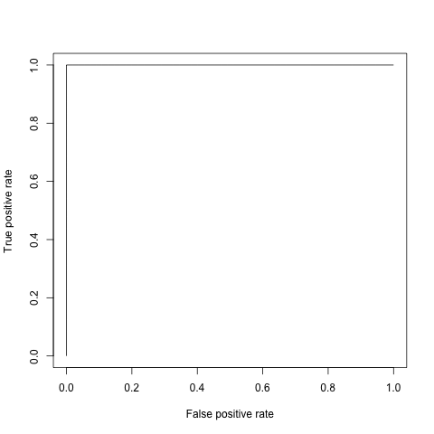

% Abhijit
% demo
% Fri Aug 23 12:17:36 2013

        &nbsp;          Estimate   Std. Error   t value   Pr(>|t|) 
---------------------- ---------- ------------ --------- ----------
   **(Intercept)**       34.59       7.345       4.709   9.609e-05 
       **disp**         0.008195    0.01446     0.5666     0.5765  
        **hp**          -0.0349     0.01866      -1.87    0.07421  
       **drat**         -0.01774     1.846     -0.009611   0.9924  
        **wt**           -3.279      1.309      -2.505    0.01979  
 **as.factor(cyl)6**     -3.104      1.653      -1.878    0.07318  
 **as.factor(cyl)8**     -2.221       3.34      -0.6649    0.5127  
 **as.factor(gear)4**    1.746        2.17      0.8046     0.4293  
 **as.factor(gear)5**    2.169       2.378      0.9121     0.3712  

Table: Fitting linear model: mpg ~ disp + hp + drat + wt + as.factor(cyl) + as.factor(gear)

     &nbsp;        Estimate   Std. Error   z value   Pr(>|z|) 
----------------- ---------- ------------ --------- ----------
 **(Intercept)**    3.045       0.1709      17.81   5.427e-71 
  **outcome2**     -0.4543      0.2022     -2.247    0.02465  
  **outcome3**      -0.293      0.1927      -1.52     0.1285  
 **treatment2**   1.338e-15      0.2      6.69e-15      1     
 **treatment3**   1.421e-15      0.2      7.105e-15     1     

Table: Fitting generalized (poisson/log) linear model: counts ~ outcome + treatment

Now here's a plot!!

-------
This report was generated with [R](http://www.r-project.org/) (3.0.1) and [pander](https://github.com/rapporter/pander) (0.3.7) in 0.624 sec on x86_64-apple-darwin10.8.0 platform.